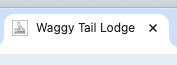
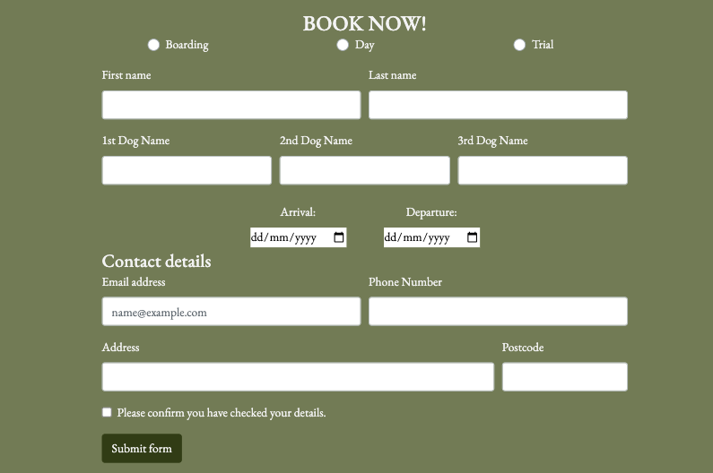

# Waggy Tail Lodge

Waggy Tail Lodge was created for a Dog Day and Boarding facility in Somerset, that currently only had a Facebook page and are looking to expand their online presents.

[View Waggy Tail Lodge Website](https://charlieburton10.github.io/waggytaillodge/index.html)

If you want to add optional [shields.io](https://shields.io) badges to your README, I like to add them to this section.

---

## CONTENTS

* [User Experience](#user-experience-ux)
  * [Intitial Discussion](#intitial-discussion)
  * [User Stories](#user-stories)

* [Design](#design)
  * [Colour Scheme](#colour-scheme)
  * [Typography](#typography)
  * [Imagery](#imagery)
  * [Wireframes](#wireframes)

* [Features](#features)
  * [General Features on Each Page](#general-features-on-each-page)
  * [Future Implementations](#future-implementations)
  * [Accessibility](#accessibility)

* [Technologies Used](#technologies-used)
  * [Languages Used](#languages-used)
  * [Frameworks, Libraries & Programs Used](#frameworks-libraries--programs-used)

* [Deployment & Local Development](#deployment--local-development)
  * [Deployment](#deployment)
  * [Local Development](#local-development)
    * [How to Fork](#how-to-fork)
    * [How to Clone](#how-to-clone)

* [Testing](#testing)

* [Credits](#credits)
  * [Code Used](#code-used)
  * [Content](#content)
  * [Media](#media)
  * [Acknowledgments](#acknowledgments)

---

## User Experience (UX)

### Intitial Discussion
Waggy Tail Lodge have decide to expand their customer base with a website. They want a website to make a better customer experience and to help attract new customers. They also want to move their booking system online instead of customers phoning there booking through.

#### Key information for the site
* What are the facilities.
* About the owners.
* Testimonials from current customers.
* Information on services and prices
* Contact and location details.
* Online booking system.

### User Stories

#### Owner Goals

* To be able to view the site on a range of device sizes.
* To make it easy for potential customers to find out what services they offer.
* To make it clear for current customers on updated prices.
* To allow customers to book online, to make the owners time more efficient.
* To make it user friendly and for all ages.

#### First Time Customers Goals

* I want to find out what Waggy Tail Lodge offers.
* I want to be able to navigate the site easily to find information.
* I want to be able to find their social media pages.
* I want to be able to book a trial.
* I want to be able to read about current customers reviews.

#### Returning Customers Goals

* I want to book online instead of phoning Waggy Tail Lodge - to help with ease.
* I want to find up-to-date prices and special offers. 
* I want to be able to easily follow them on social media pages to get dog updates.

## Design

### Colour Scheme

The website uses a palette of shades of green, to imitate the grass that the dogs spend alot of time on. The colour palette was created using the [Coolors](https://coolors.co/) website.

### Typography

I have used EB Garamond from Google Fonts for this website. It is a serif font.

### Imagery

All imagery used within the site has been chosen to showcase the Waggy Tail Lodge. I created a new logo for the owners, as they asked for it to have a more modern look. I have credited these at the end.

### Wireframes

Wireframes were created for mobile, tablet and desktop.

## Features

The website is comprised of a home page, our services page, a contact & FAQ page & a book now.

### General features on each page

All Pages on the website are responsive and have:

* A favicon in the browser tab.

* All Pages on the website have:

  * To the left of the site is their logo. To the right of the navigation bar are the links to the websites pages. 

    

  * In the middle is the Title and tag line.

    

  * A footer which contains social media icon links to Facebook, Instagram and Twitter. 

    

* Home Page

  * About Us - A photo and introduction to the owners.
  * Our Facility - A carousel of photos that shows the facilities, followed by a description.
  * Testimonals - Four reviews with photos of the indiviuals.

* Our Services

  * Day Care - a description on what is on offer.
  * Boarding Care - a description on what is on offer.
  * Daily Routine - a table with a daily routine.
  * Price List - a list of prices.
  * Special Offers - a description of special offers.

* Contact & FAQ
  * Contact details - including address, phone numbers and email.
  * Location - with a link to google maps.
  * FAQ - a dropdown of frequent asked questions.

* Book Now!
  * Subscribe to our Newsletter - pop up box with name and email to submit.
  * Form - for booking Day, Boarding or a Trial.

### Future Implementations

* Link the website to a booking system database to help save customer details.
* Create a login for customers.
* To be able to give a live calender with availbility for automatic confirmation.
* Being able to take payments and desposits for the booking.

### Accessibility

 * I have used the alt attirbutes on images.
 * I have made sure there is colour contrast on the site. 
 * I have used semantic HTML. 
 * I have used a hover state on all buttons on the site to make it clear to the user if they are hovering over a button.

## Technologies Used

### Languages Used

* HTML and CSS were used to create this website.

### Frameworks, Libraries & Programs Used

* [Balsamiq](https://balsamiq.com/) - Used to create wireframes.

* [Git](https://git-scm.com/) - For version control.

* [Github](https://github.com/) - To save and store the files for the website.

* [GitPod](https://gitpod.io/) - IDE used to create the site.

* [Google Fonts](https://fonts.google.com/) - To import the fonts used on the website.

* [jQuery](https://jquery.com/) - A JavaScript library.

* [Google Developer Tools](https://developers.google.com/web/tools) - To troubleshoot and test features, solve issues with responsiveness and styling.

* [TinyPNG](https://tinypng.com/) To compress images

* [Image Resizer](https://imageresizer.com/)

* [Favicon.io](https://favicon.io/) To create favicon.

* [Am I Responsive?](http://ami.responsivedesign.is/) To show the website image on a range of devices.

* [Webpage Spell-Check](https://chrome.google.com/webstore/detail/webpage-spell-check/mgdhaoimpabdhmacaclbbjddhngchjik/related) - a google chrome extension that allows you to spell check your webpage. Used to check the site and the readme for spelling errors.

## Deployment & Local Development

### Deployment

Github Pages was used to deploy the live website. The instructions to achieve this are below:

1. Log in to Github.
2. Find the repository for this project, waggytaillodge.
3. Click on the Settings button.
4. Click on the Pages button in the left hand side bar.
5. In the Source section, choose main from the drop down select branch menu. Select Root from the drop down select folder menu.
6. Click Save. Your live Github Pages site is now deployed at the URL shown.

### Local Development

The local development section gives instructions on how someone else could make a copy of your project to play with on their local machine. This section will get more complex in the later projects, and can be a great reference to yourself if you forget how to do this.

#### How to Fork

To fork waggytaillodge repository:

1. Log in to Github.
2. Go to the repository for this project, CharlieBurton10/waggytaillodge
3. Click the Fork button at the top of the page between Watch and Starred.

#### How to Clone

To clone waggytaillodge repository:

1. Log in to Github.
2. Go to the repository for this project, CharlieBurton10/waggytaillodge
3. Click on the code button, select whether you would like to clone with HTTPS, SSH or GitHub CLI and copy the link shown.
4. Open the terminal in your code editor and change the current working directory to the location you want to use for the cloned directory.
5. Type 'git clone' into the terminal and then enter.
6. Then paste link from step 3 ($ git clone https://github.com/CharlieBurton10/waggytaillodge) and then press enter.

## Testing

Testing has been on going throughout the build with Chrome developer tools.

My mentor on our mid project meeting discussed: 
* My image files were to big for the website, so I have resized and croped to the aspect ratio and then optimized them.
* There was problem that some of the images overlapped when checking that pages of the Website were responsive. This issue is documented as 2. under Solved Bugs.

### W3C Validator

The W3C validator was used to validate the HTML on all pages of the website. It was also used to validate CSS in the style.css file.

[Index Page HTML](docs/testing/w3cindex.png) - Passed but had 2 info points and then corrected them on the other pages.

[Our Services Page HTML](docs/testing/w3courservices.png) - 1 error on a stray div. Now deleted.

[Contact & FAQ Page HTML](docs/testing/w3ccontact.png) - 1 error and 1 warning for the google map. This is documented as 3. under Solved Bugs.

[Book Now! Page HTML](docs/testing/w3cindex.png) - Passed

[style.css](docs/testing/w3ccss.png) - 1 error on a property that doesn't exist. Now deleted.

### Solved Bugs
1. The About Us section on the home page was not fitting properly when it was on a medium screen. So I changed the bootstrap grid system to large.
2. The images when on a medium device were overlapping with text. I fixed this by changing the bootstrap grid system from small to medium.
 
3. I had adjusted the Google Maps width to 100% to make the page responsive. The error was the % sign on the iframe code. I have reinserted a new link to Google Maps to clear the error and then put a paragraph aboud the iframe to be able to center the map allowing it to be more responsive. For the warning I just changed the section to a div.

### Known Bugs

On the Chrome developer tool, it comes up with 6 warnings and 24 verbose for the Google Maps link. The 6 warnings are regarding third party cookies will be blocked. The 28 verbose are for "Added non-passive event listener to a scroll-blocking event. Consider marking event handler as 'passive' to make the page more responsive." When researching and looking on slack I was unable to find a solution without using JavaScript. As I don't have any experience so far with JavaScript this is currently unable to implement, but would be able to update it in the future.

### Testing User Stories

#### First Time Customers Goals

* I want to find out what Waggy Tail Lodge offers.
    * Our Services page explains what the Waggy Tail Lodge offers including prices and specials.

* I want to be able to navigate the site easily to find information.
    * All site navigation is in the top right corner on every page of the website.

    
* I want to be able to find their social media pages.
    * In the footer on every page sits links to the social media pages.

    
* I want to be able to book a trial.
    * On the Book Now! page this is an option to select what you are booking.

    
* I want to be able to read about current customers reviews.
    * On the Home page there are some testimonials from 4 customers.

    

#### Returning Customer Goals

* I want to book online instead of phoning Waggy Tail Lodge - to help with ease.
    * On the nav bar is a Book Now! button that takes them to a form to complete with details of the booking.

    
* I want to find up-to-date prices and special offers. 
    * On the Our Services page, the prices and specials offers sit.

    
* I want to be able to easily follow them on social media pages to get dog updates.
    * In the footer on every page sits links to the social media pages.

    

### Further Testing

 * The website was tested on Google Chrome, Safari,and Microsoft Edge browsers

## Credits

### Code Used

  * [Tutorial Republic to add pop up box on booknow.html](https://www.tutorialrepublic.com/faq/how-to-align-bootstrap-modal-vertically-center.php)
  * [w3schools to help with carousel](https://www.w3schools.com/bootstrap/bootstrap_carousel.asp)

### Content

Content for the website was written by myself.

###  Media

#### Header
* [Alexas Fotos](https://www.pexels.com/photo/a-cute-dogs-running-on-green-grass-field-12874286/)

#### About Us
* [Vladimir Konoplev](https://www.pexels.com/photo/couple-with-their-pet-dogs-11885342/)

#### Our Facility
* [Alvan Nee](https://unsplash.com/photos/two-brown-and-white-dogs-running-dirt-road-during-daytime-T-0EW-SEbsE?utm_content=creditCopyText&utm_medium=referral&utm_source=unsplash)
* [Anna Dudkova](https://unsplash.com/photos/brown-and-white-dog-on-grass-urs_y9NwFcc?utm_content=creditCopyText&utm_medium=referral&utm_source=unsplash)
* [Ayla Verschueren ](https://unsplash.com/photos/a-brown-and-white-dog-inside-of-a-cage-qvbG3-tZnyc?utm_content=creditCopyText&utm_medium=referral&utm_source=unsplash)
* [Anthony Duran](https://unsplash.com/photos/black-and-white-american-pitbull-terrier-mix-puppy-on-water-eLUBGqKGdE4?utm_content=creditCopyText&utm_medium=referral&utm_source=unsplash)
* [Gary Lee](https://unsplash.com/photos/a-dog-laying-in-the-grass-next-to-a-tennis-ball-4EEmLlEZdQ8?utm_content=creditCopyText&utm_medium=referral&utm_source=unsplash)

#### Testimonials
* [Christopher Campbell](https://unsplash.com/photos/shallow-focus-photography-of-woman-outdoor-during-day-rDEOVtE7vOs?utm_content=creditCopyText&utm_medium=referral&utm_source=unsplash)
* [Y_K](https://unsplash.com/photos/woman-standing-on-concrete-stair-uZCY6vjHGmE?utm_content=creditCopyText&utm_medium=referral&utm_source=unsplash)
* [Samanta Barba Alcalá](https://unsplash.com/photos/man-taking-selfie-wearing-white-dress-shirt-QwNUkiDxjbo?utm_content=creditCopyText&utm_medium=referral&utm_source=unsplash)
* [Carly Rae Hobbins](https://unsplash.com/photos/woman-riding-on-back-of-man-zNHOIzjJiyA?utm_content=creditCopyText&utm_medium=referral&utm_source=unsplash)

#### Our Services
* [Janosch Diggelmann](https://unsplash.com/photos/black-and-white-short-coated-small-dog-on-blue-and-white-textile-6mNIZRnTSRE?utm_content=creditCopyText&utm_medium=referral&utm_source=unsplash)
  
###  Acknowledgments

I would like to thank my Code Institute Mentor, Can Sucullu for his helpful feedback and Tutor Support at Code Institute.
